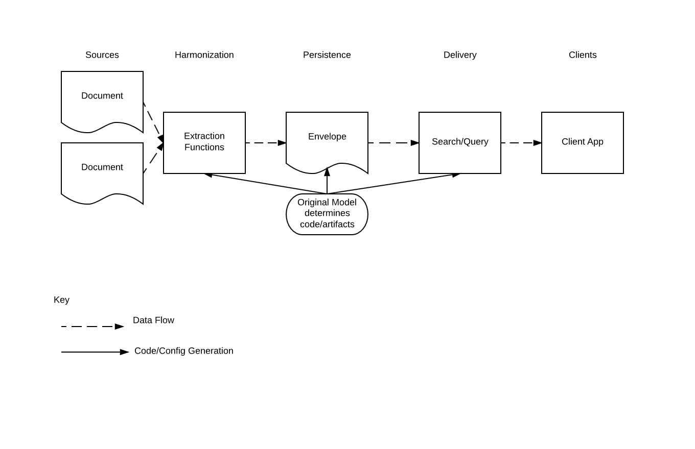
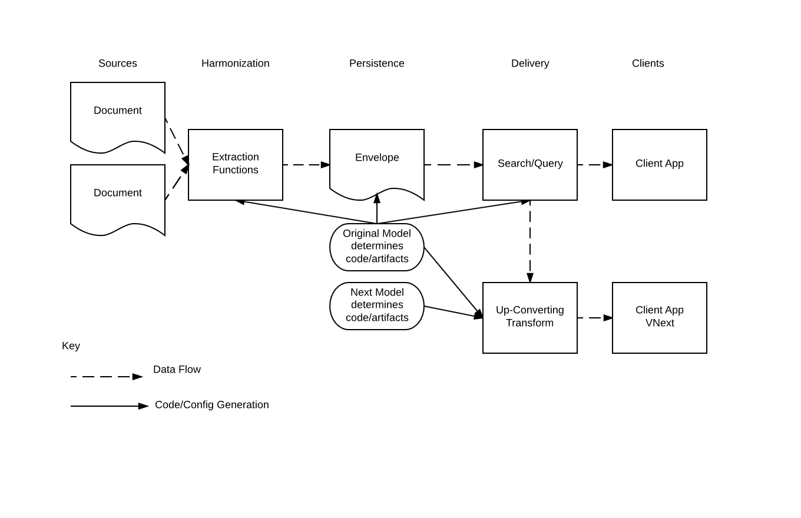
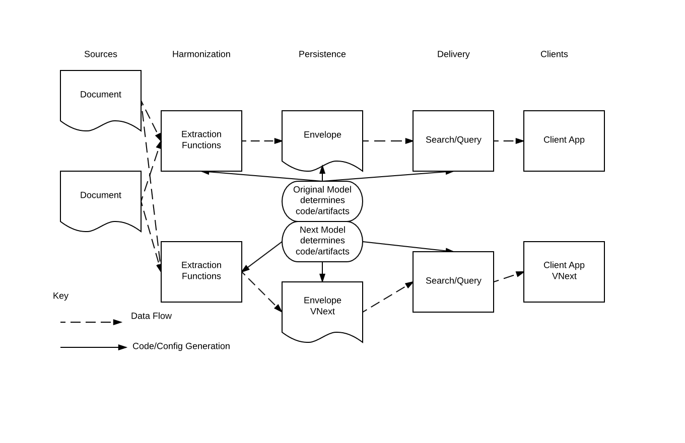
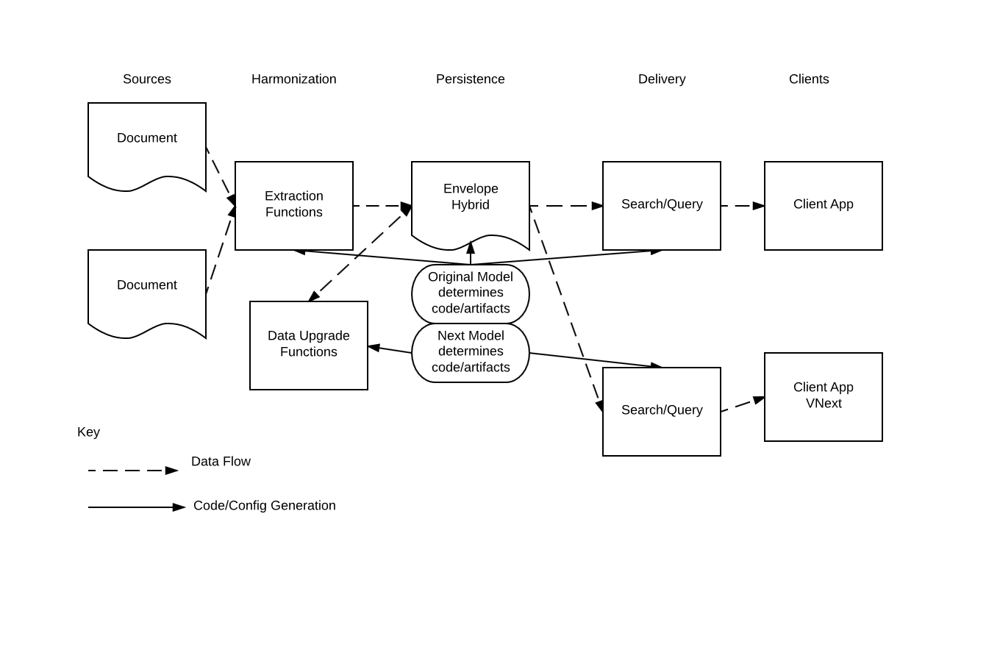
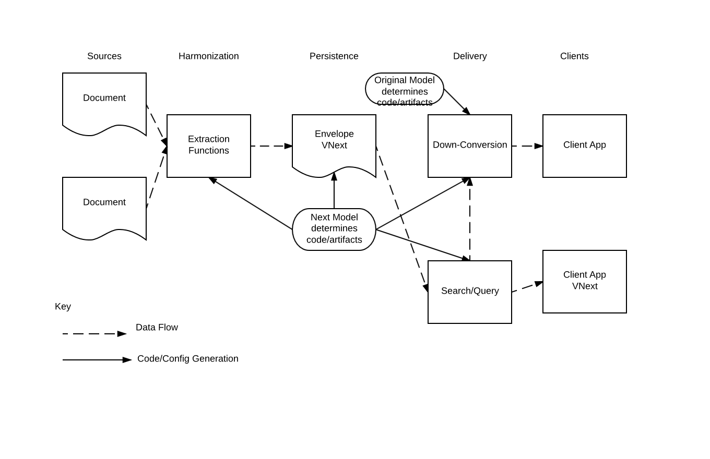
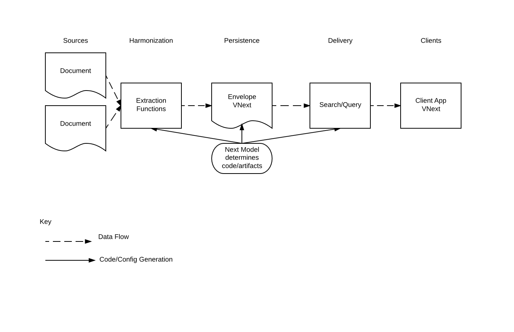

Versions Example
----------------

This entity services example strips the concept of entity versions
to its simplest.  The simplest use of Entity Services version code is to
facilitate the migration of data models, instance data, and service contracts.

In the starting point, we posit a steady-state, just deployed
greenfield data flow, with sources, a mechanism for persisting entity
instances, and a layer for exposing entity data to downstream applications.

```text
Extraction  ->          Persistence  ->       Delivery
Sources     =extract=>  Envelopes    =query=> Services 
```

The first `=>` above is the function by which data is extracted
into envelopes.  The second is some kind of API call that satisfies
a contract.  Data flows from source systems into MarkLogic.  Some 
process extracts entity instance data from these sources and persists
them in envelopes.  The TDE templates, range index definitions and 
Search API configuration is used to deliver those envelopes to downstream applications.
The model determines extraction code, the persistence structure, and how
queries can be written.

Change
------

This example demonstrates what change looks like in a Data Hub.
There are a few ways that the hub can change, but the end state we are
interested in is one in which a model has changed, and the data and
downstream systems are migrated to take advantage of new models without
interrupting service.  So we are interested in how models can change, and
how to implement change management in the hub.

What can change?

* Sources.  If a source changes, there is no immediate requirement to change the data hub.  
In a "minimal model" changes to the sources need not require a change to the model.
Source changes could cause breaking changes in extraction code, but unless the
hub requires new strategies for persistence or services, then the model probably
does not need to change just because sources do.
* Client requirements.  Clients can change and develop independently of a model. However
the model determines a contract between Data Hub and client applications.  If the contract 
changes, that's when a data model change may also be required.
* Models.  Models determine the product of extraction functions.  If the requirements
for downstream applications change, then a new model version can be developed to meet 
those requirements. With a new model comes new extraction functions, a new envelope 
structure, and new capabilities.
* Code artifacts.

After a model change, all clients will migrate to take advantage of the new model and its
capabilities.  However, clients need to upgrade independently of data or models, so
Entity Services helps to create interim scenarios that handle more than one model at a time.

Here are the steps:

1. Steady state.  Source version 1.  Model.  Client.
1. Source changes.  No change to models or clients, but new data flows into the hub.  
Attachments change because they store the original docs, but the canonical model remains the same.
1. Model update.  The model adds a property.  We install new extraction functions that can create new envelopes.
We can load the new data if we wish to see it. It will not affect the operation of downstream applications 
( ... more info about search ...)
1. Extract using new model.  If a data hub is able, it can re-import data with a new extraction method.
1. Convert data using version translator.  If re-extraction is not feasible or not desired, the version
translator helps to migrate data from one model version to another.  Keeping both envelopes 
(or both instances in one envelope) is an option to support client upgrade.
1. Create up-convert transform.  This transform, supported by es:version-translator-generate, 
will serve up the old envelopes to new clients using a transform.  This up-convert method is 
suitable for getting new clients online and tested before upgrading envelopes *maybe not common?*
1. Create down-convert transforms.  When moving clients from the original instance data to a new one, 
down-convert transforms enable clients to stay on the original contract.

Example Code
------------

This example works by providing several REST resource extensions, each of which act as a complete 
example of a trivial data hub.  Each extension represents a possible step along the evolutionary
  progression of a hub as it supports the transition of one model to the next.  The data hubs accept:

PUT  put source documents into the hub.
GET  Run searches or SQL queries over entities
DELETE Clear the content database.

* The original data model, called "Model", version "original".  
It has one type called "Person".  The type has two properties, 
an integer called 'id' which is also its primary Key, and a firstName property.
* Sources look like this, in JSON: `{"id":123, "firstName":"Charles"}`
* Source 2 looks like this, in JSON: `{"id":123, "firstName":"Charles","fullName":"Nonsense Name"}`
* The subsequent model is also called "Model", version "next".  It simply adds a single 
property to "Person" called "fullName", which is optional.
* The function to up-convert from Model-original to Model-next. (adds "fullName" with a default value)
* The function to down-convert from Model-next to Model-orignal (drops "fullName")
* There is a function to migrate Model-original envelopes to Model-next.

```
hub.xqy:  The original hub.
GET with parameter rs:q is a Search API query.
GET with parameter rs:sql is a SQL query.
```


```
transition-A.xqy, an up-converting hub
GET with parameter rs:q is a Search API query.
GET with parameter rs:sql is a SQL query.
Adding rs:version=next invokes a transform that returns model-next's payload
```


```
transition-B.xqy, a hybrid hub with two extraction pipelines
It extracts data into both the original model and the next one.
```


```
transition-C.xqy is a hybrid hub that upgrades data from version-original 
to version-next in-place, and retains the next one, and retains both 
copies to serve to clients.
```



```
transition-D.xqy extracts into model-next.  If rs:version=original, then
it down-converts the data to serve to older clients.
```


```
hub-next.xqy is the version-next hub after all clients and sources have been upgraded.
```



Running Transitional Hubs
-------------------------

The process of migrating data forward is complicated somewhat by the fact that
a database only has one state at a time.  Deployment of index configurations,
schemas, and extraction templates cannot be versioned, they must be managed as
part of the evolution of a hub.

This hub scenario handles extraction templates and indexes in different ways.

You may have noticed that example changes data simply by adding a property to
the Person type.  It also makes a change by adding a word lexicon on that
property.  An index change is a change in database state, and so it is either
done or not done.  Once the index is configured and deployed, applications can
use it.  If a model were to change such that indexes are no longer needed, the
system must maintain both indexes until the data migration is complete.  In
this scenario, we've chosen simply to include the "Model-next" index
configuration in the deployment.  Its presence does not affect the original
hub, and so during the course of this exercise it is latent, only used by the
'next' version of search options.

Something similar stands for extraction templates.  Since we wanted views of
both kinds of instances to be active at once, the extraction templates for each
model have unique Schema Names.  This means that 'Model.Peron' and
'ModelNext.Person' are both available in the transitional hubs.  After migration
is complete, there may be a final update to TDE configuration to mark the
current best version of a view.

when you run `./gradlew runExampleVersions` you'll see something like the
following output.  Below are the requests underlying the output, and
explanations.  Note that the example uses the Java Client, so these requests
are not obvious from the code.


### Original Hub

The first four requests/response are against the original hub.  This first
response from the original hub for the search `id:1` has a single result.
This method simply outputs both the result (The entity with id = 1) as well as
a serialization of the query that ran to produce the results.  Entity services
generated the search grammar behind the query string `id:1`.


```
Search for id:1

GET /v1/resources/hub?rs:q=id:1

{"Person":{"id":"1", "firstName":"Thomas"}}
<cts:element-value-query xmlns:cts="http://marklogic.com/cts">
  <cts:element>id</cts:element>
  <cts:text xml:lang="en">1</cts:text>
</cts:element-value-query>
```


On the original hub, there is no configuration for "fullName".  So this property does not 
exist in the search grammar.  There are no results, because this version of the hub
treats this query as a word search for the string "fullName:A" which occurs in no document.


```
Search for fullName:A*

GET /v1/resources/hub?rs:q=fullName:A*

<cts:word-query xmlns:cts="http://marklogic.com/cts">
  <cts:text xml:lang="en">fullName:A*</cts:text>
</cts:word-query>
```


Third, a sql query.
Use SQL to fetch all values from the generated view.  There are three
records and two columns in the Model.View view.


```
Select * from Model.Person

GET /v1/resources/hub?rs:sql=select * from Model.Person

["Model.Person.id", "Model.Person.firstName"]
[0, "Brody"]
[1, "Thomas"]
[2, "Makayla"]
```


Last, we attempt to query the view backing the next-gen model.
Since no 'version next' data exists in the original hub, there are no results.


```
Select * from ModelNext.Person

GET /v1/resources/hub?rs:sql=select * from ModelNext.Person

["ModelNext.Person.id", "ModelNext.Person.firstName", "ModelNext.Person.fullName"]

```


### Transition-A

The running example loads data for each scenario, then runs these same queries
again.  All requests are the same as the original hub, until we introduce
the version parameter:


```
Search for id:1

GET /v1/resources/transition-A?rs:q=id:1

{"Person":{"id":"1", "firstName":"Arianna"}}
<cts:element-value-query xmlns:cts="http://marklogic.com/cts">
<cts:element>id</cts:element>
  <cts:text xml:lang="en">1</cts:text>
</cts:element-value-query>


Search for fullName:A*

GET /v1/resources/transition-A?rs:q=fullName:A*

<cts:word-query xmlns:cts="http://marklogic.com/cts">
  <cts:text xml:lang="en">fullName:A*</cts:text>
</cts:word-query>


Select * from Model.Person

GET /v1/resources/transition-A?rs:sql=select * from Model.Person

["Model.Person.id", "Model.Person.firstName"]
[0, "Christian"]
[1, "Arianna"]
[2, "Lucas"]

Select * from ModelNext.Person

GET /v1/resources/transition-A?rs:sql=select * from ModelNext.Person

["ModelNext.Person.id", "ModelNext.Person.firstName", "ModelNext.Person.fullName"]
```

At this stage in the data migration, using a version parameter puts a default
value in for the new structures:

```
GET /v1/resources/transition-A?rs:q=id:1&rs:version=next

id:1 plus version next
{"Person":{"id":"1", "firstName":"Arianna", "fullName":"A default value"}}
<cts:element-value-query xmlns:cts="http://marklogic.com/cts">
  <cts:element>id</cts:element>
  <cts:text xml:lang="en">1</cts:text>
</cts:element-value-query>
```


### Transition-B

Here are the requests for this stage.  The difference now is that, since we have
version-next data in the database, we can query for and get entities of version 2, 
and also access the `ModelNext` schema.


```
Search for id:1

GET /v1/resources/transition-B?rs:q=id:1

{"Person":{"id":"1", "firstName":"Aubree"}}
<cts:element-value-query xmlns:cts="http://marklogic.com/cts">
  <cts:element>id</cts:element>
  <cts:text xml:lang="en">1</cts:text>
</cts:element-value-query>


Select * from Model.Person

GET /v1/resources/transition-B?rs:sql=select * from Model.Person

["Model.Person.id", "Model.Person.firstName"]
[0, "Wyatt"]
[1, "Aubree"]
[2, "Zoey"]

Select * from ModelNext.Person

GET /v1/resources/transition-B?rs:sql=select * from ModelNext.Person

["ModelNext.Person.id", "ModelNext.Person.firstName", "ModelNext.Person.fullName"]
[1, "Aubree", "Aubree Ruiz"]
[0, "Wyatt", "Wyatt Simon"]
[2, "Zoey", "Zoey Lowe"]


id:1 plus version next

GET /v1/resources/transition-B?rs:q=id:1&rs:version=next

{"Person":{"id":"1", "firstName":"Aubree", "fullName":"Aubree Ruiz"}}
<cts:element-value-query xmlns:cts="http://marklogic.com/cts">
  <cts:element>id</cts:element>
  <cts:text xml:lang="en">1</cts:text>
</cts:element-value-query>


Select * from Model.Person

GET /v1/resources/transition-B?rs:sql=select * from Model.Person

["Model.Person.id", "Model.Person.firstName"]
[0, "Wyatt"]
[1, "Aubree"]
[2, "Zoey"]

Select * from ModelNext.Person

GET /v1/resources/transition-B?rs:sql=select * from ModelNext.Person

["ModelNext.Person.id", "ModelNext.Person.firstName", "ModelNext.Person.fullName"]
[1, "Aubree", "Aubree Ruiz"]
[0, "Wyatt", "Wyatt Simon"]
[2, "Zoey", "Zoey Lowe"]
```


### Transition-C


In responses to these requests, the next version is now default.
A search or `id:1` returns the entities with three properties.
Both versions are available for query and search though.
Also, with the new version being default, the fullName:A\* search
works, as there is now a lexicon to back the fullName property.


```
Search for id:1

GET /v1/resources/transition-C?rs:q=id:1

{"Person":{"id":"1", "firstName":"Noah", "fullName":"Noah Hernandez"}}
<cts:element-value-query xmlns:cts="http://marklogic.com/cts">
  <cts:element>id</cts:element>
  <cts:text xml:lang="en">1</cts:text>
</cts:element-value-query>


id:1 plus version original

GET /v1/resources/transition-C?rs:q=id:1&rs:version=original

{"Person":{"id":"1", "firstName":"Noah"}}
<cts:element-value-query xmlns:cts="http://marklogic.com/cts">
  <cts:element>id</cts:element>
  <cts:text xml:lang="en">1</cts:text>
</cts:element-value-query>


Search for fullName:A*

GET /v1/resources/transition-C?rs:q=fullname:A*

<cts:element-word-query xmlns:cts="http://marklogic.com/cts">
  <cts:element>fullName</cts:element>
  <cts:text xml:lang="en">A*</cts:text>
  <cts:option>case-insensitive</cts:option>
  <cts:option>wildcarded</cts:option>
</cts:element-word-query>


Select * from Model.Person

GET /v1/resources/transition-C?rs:sql=select * from Model.Person


["Model.Person.id", "Model.Person.firstName"]
[0, "Jace"]
[1, "Noah"]
[2, "Mackenzie"]

Select * from ModelNext.Person

GET /v1/resources/transition-C?rs:sql=select * from ModelNext.Person

["ModelNext.Person.id", "ModelNext.Person.firstName", "ModelNext.Person.fullName"]
[0, "Jace", "Jace Jackson"]
[2, "Mackenzie", "Mackenzie Gillespie"]
[1, "Noah", "Noah Hernandez"]
```


### Transition-D

This version of the hub just has the new documents, but can construct
the old versions with a down-transform and the version=original parameter.


```
Search for id:1

GET /v1/resources/transition-D?rs:q=id:1

{"Person":{"id":"1", "firstName":"Sophia", "fullName":"Sophia Whitley"}}
<cts:element-value-query xmlns:cts="http://marklogic.com/cts">
  <cts:element>id</cts:element>
  <cts:text xml:lang="en">1</cts:text>
</cts:element-value-query>


id:1 plus version original

GET /v1/resources/transition-D?rs:q=id:1&rs:version=original

{"Person":{"id":"1", "firstName":"Sophia"}}
<cts:element-value-query xmlns:cts="http://marklogic.com/cts">
  <cts:element>id</cts:element>
  <cts:text xml:lang="en">1</cts:text>
</cts:element-value-query>


Search for fullName:A*

GET /v1/resources/transition-D?rs:q=fullname:A*

<cts:element-word-query xmlns:cts="http://marklogic.com/cts">
  <cts:element>fullName</cts:element>
  <cts:text xml:lang="en">A*</cts:text>
  <cts:option>case-insensitive</cts:option>
  <cts:option>wildcarded</cts:option>
</cts:element-word-query>

Select * from Model.Person

GET /v1/resources/transition-D?rs:sql=select * from Model.Person

["Model.Person.id", "Model.Person.firstName"]

Select * from ModelNext.Person

GET /v1/resources/transition-D?rs:sql=select * from ModelNext.Person

["ModelNext.Person.id", "ModelNext.Person.firstName", "ModelNext.Person.fullName"]
[0, "Nolan", "Nolan Best"]
[1, "Sophia", "Sophia Whitley"]
[2, "Thomas", "Thomas Holloway"]
```


### Hub after transition

Lastly, the replacement hub no longer serves the old documents.
The Model.Person view is now empty.


```
Search for id:1

GET /v1/resources/hub-next?rs:q=id:1

{"Person":{"id":"1", "firstName":"Charles", "fullName":"Charles Hendricks"}}

Select * from Model.Person

GET /v1/resources/transition-D?rs:sql=select * from Model.Person

["Model.Person.id", "Model.Person.firstName"]

Select * from ModelNext.Person

GET /v1/resources/transition-D?rs:sql=select * from ModelNext.Person

["ModelNext.Person.id", "ModelNext.Person.firstName", "ModelNext.Person.fullName"]
[1, "Charles", "Charles Hendricks"]
[2, "Damian", "Damian Mcintosh"]
[0, "Lily", "Lily Snyder"]
```


